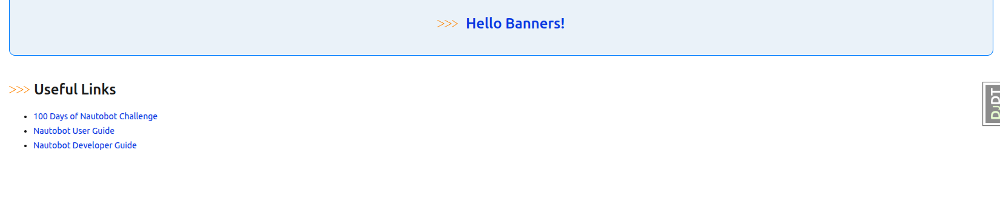
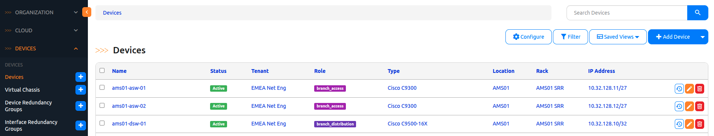
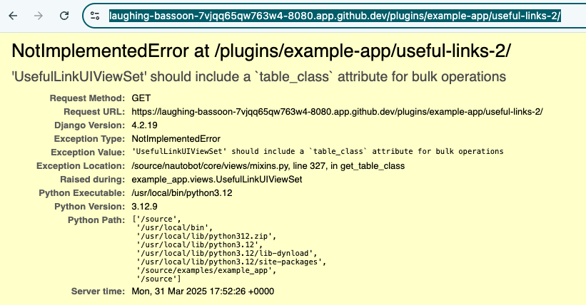
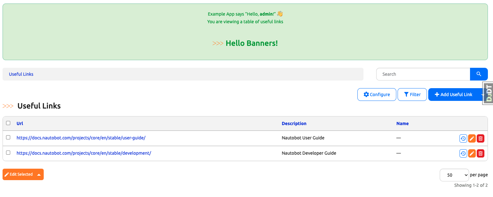

# Nautobot Views: Applying What We've Learned

Now that we have a better understanding of Class-Based Views (CBVs), Nautobot Generic Views, and `NautobotUIViewSet`, it's time to see it in action!

In today's challenge, we'll apply what we've learned so far to make improvements to our code from previous challenges. This exercise will focus primarily on `NautobotUIViewSet` but it should enforce our learning of all three topics.

## Environment Setup

We will use a combination of [Scenario 2](../Lab_Setup/scenario_2_setup/README.md) lab, [https://demo.nautobot.com/](https://demo.nautobot.com/), and [Nautobot Documentation](https://docs.nautobot.com/projects/core/en/latest/user-guide/core-data-model/overview/introduction/) for today's challenge. 

```$ cd nautobot
$ poetry shell
$ poetry install
$ invoke build
(be patient with this step)
$ invoke debug
(be patient with this step as well)
```

## Converting to NautobotUIViewSet

Let's recall our code from Days [Day 50](https://github.com/nautobot/100-days-of-nautobot/tree/main/Day050_Example_App_Overview) to [Day 59](https://github.com/nautobot/100-days-of-nautobot/tree/main/Day059_Example_App_Other_Considerations) where we used the `Example App` in the nautobot repository to add useful links (model, view, URL, and navigation) to the app. 

Remember this view? It didn't quite have that familiar Nautobot look and feel.



Let's see how we can give it the same UI we are all accustomed to, as shown in the image below. 


 

We will re-use the same `UsefulLink` model we created in [Day 52](https://github.com/nautobot/100-days-of-nautobot/blob/main/Day052_Example_App_Creating_Data_Models_Part_2/README.md), which can be found in the `models.py`. If you need to re-create it, remember to use `makemigrations` and `migrate` to update the database. 

Here is the code snippet for the model under `nautobot -> examples -> example_app -> models.py`: 

```python models.py
from django.db import models

class UsefulLink(BaseModel):
    url = models.URLField(unique=True)
    description = models.CharField(max_length=255)

    def __str__(self):
        return self.url
```

The next step would be to create the new `view` for the model using the `NautobotUIViewSet` framework. We can add the following code to  `views.py` file under `example_app`: 

```python file=views.py
from nautobot.apps.ui import ObjectDetailContent, SectionChoices, ObjectFieldsPanel

class UsefulLinkUIViewSet(views.NautobotUIViewSet):
    queryset = UsefulLink.objects.all()

    object_detail_content = ObjectDetailContent(
        panels=[
            ObjectFieldsPanel(
                weight=100,
                section=SectionChoices.LEFT_HALF,
                fields=[
                    "url",
                    "description",
                ],
            )
        ]
    )
```
Let's compare this new view with our previous one, which uses the generic `ListView`. Notice the differences? Any similarities?

```python file=views.py
class UsefulLinkListView(ListView): 
    model = UsefulLink
    template_name = "example_app/useful_link_detail.html"
    context_object_name = "useful_links"

    def get_queryset(self):
        return UsefulLink.objects.all()
```

First, we're still using the queryset in our new code but notice we did not specify the exact HTML template to render? This is one of the benefits of `NautobotUIViewSet`. We can just inherit those characteristics, saving us a lot of coding time!

How do we know to use `object_detail_content` and `ObjectDetailContent` for our code? It was a combination of reading the doc for [Basic Setup](https://docs.nautobot.com/projects/core/en/stable/development/core/ui-component-framework/#basic-setup) and reading the code snippet for `ExampleModelUIViewSet` in the `example_app -> views.py` file. 

> [!NOTE]
> We will discuss Nautobot UI Components like [Panels](https://docs.nautobot.com/projects/core/en/stable/development/core/ui-component-framework/#panels) along with [Tabs](https://docs.nautobot.com/projects/core/en/stable/development/core/ui-component-framework/#panels) and [Buttons](https://docs.nautobot.com/projects/core/en/stable/development/core/ui-component-framework/#buttons) in the coming days so don't worry about that part of the code. 

From our lesson in [Day 67](../Day067_Nautobot_Views_2_Nautobot_UI_ViewSet/), we know that we need to register the new `viewset` with `NautobotUIViewSetRouter` in `urls.py`. To avoid conflict, we will use `useful-link-2` as the endpoint (recall our previous URL was `useful-link`): 

```python file=urls.py
app_name = "example_app"
router = NautobotUIViewSetRouter()
...
router.register("useful-links-2", views.UsefulLinkUIViewSet)
```

We can now point our browser to `https://<name>.app.github.dev/plugins/example-app/useful-links-2/` to take a look at the page. 

Oops, there is an error: 



As it turns out, the components of `tables` and `filtersets` (which we will go over in future days) are tightly coupled with Nautobot UI component framework, so we will need to include them here. Fortunately, they are not difficult to understand, even if it's the first time we see their usage. 

Let's add the following code to `nautobot -> examples -> example_app -> tables.py`: 

```python file=tables.py
from example_app.models import AnotherExampleModel, ExampleModel, UsefulLink

class UsefulLinkModelTable(BaseTable):
    """Table for list view of `UsefulLink` objects."""

    pk = ToggleColumn()
    name = tables.LinkColumn()
    actions = ButtonsColumn(ExampleModel)

    class Meta(BaseTable.Meta):
        model = UsefulLink
        fields = ["url", "description"]
```

Add the following code to `nautobot -> examples -> example_app -> filters.py`:

```python file=filters.py
from example_app.models import AnotherExampleModel, ExampleModel, UsefulLink

class UsefulLinkModelFilterSet(BaseFilterSet):
    """API filter for filtering usefullink model objects."""

    q = SearchFilter(
        filter_predicates={
            "url": "icontains",
            "description": "icontains",
        },
    )

    class Meta:
        model = UsefulLink
        fields = [
            "url",
            "description",
        ]
```

Now that the related filter and table object habe been added, we can include them in the `views.py` code without causing any errors:

```python views.py
class UsefulLinkUIViewSet(views.NautobotUIViewSet):
    queryset = UsefulLink.objects.all()
    table_class = tables.UsefulLinkModelTable #new
    filterset_class = filters.UsefulLinkModelFilterSet #new
    object_detail_content = ObjectDetailContent(
        panels=[
            ObjectFieldsPanel(
                weight=100,
                section=SectionChoices.LEFT_HALF,
                fields=[
                    "url",
                    "description",
                ],
            )
        ]
    )
```

Let's try navigating again to the `useful-link-2` page to check out our page:



And there it is! The familiar Nautobot look and functionality we're all used to. 

As you can see, using `NautobotUIViewSet` makes it easy to tap into Nautobot’s built-in UI features—like object pages, forms, tables, and filters, without having to build everything from scratch. It helps keep things consistent and user-friendly, so your custom models feel just like the rest of Nautobot.


Congratulations on completing Day 69!

## Resources 

- [NautobotUIViewSet](https://docs.nautobot.com/projects/core/en/stable/development/apps/api/views/nautobotuiviewset/)
- [nautobot.apps.ui](https://docs.nautobot.com/projects/core/en/stable/code-reference/nautobot/apps/ui/)

## Day 69 To Do

Remember to stop the codespace instance on [https://github.com/codespaces/](https://github.com/codespaces/). 

Go ahead and post a screenshot of a new page that we rendered using Nautobot UI View Set from today's challenge on a social media of your choice, make sure you use the tag `#100DaysOfNautobot` `#JobsToBeDone` and tag `@networktocode`, so we can share your progress! 

In tomorrow's challenge, we will be going over deeper into Nautobot UI Component framework, starting with Nautobot UI Styling. See you tomorrow! 

[X/Twitter](<https://twitter.com/intent/tweet?url=https://github.com/nautobot/100-days-of-nautobot&text=I+just+completed+Day+69+of+the+100+days+of+nautobot+challenge+!&hashtags=100DaysOfNautobot,JobsToBeDone>)

[LinkedIn](https://www.linkedin.com/) (Copy & Paste: I just completed Day 69 of 100 Days of Nautobot, https://github.com/nautobot/100-days-of-nautobot-challenge, challenge! @networktocode #JobsToBeDone #100DaysOfNautobot) 
