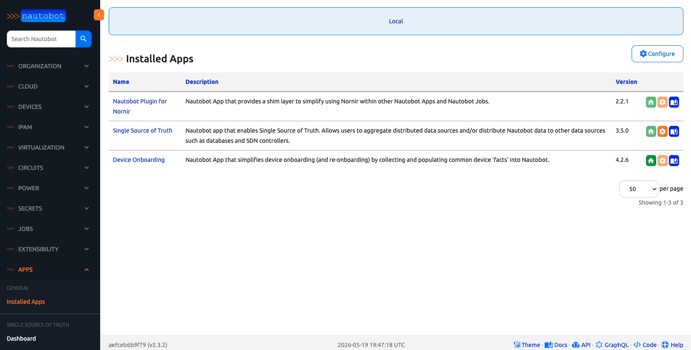

# Day 1: Install Device Onboarding

Today we install [`nautobot-device-onboarding`](https://github.com/nautobot/nautobot-app-device-onboarding) on top of Scenario 1 and confirm it shows up in the Nautobot UI. No devices get onboarded today — that is Day 3.

The Containerlab cEOS topology is **not** needed today — we will spin it up on Day 2.

## Why we bake the apps into the image

`nautobot-docker-compose` builds its Nautobot image via `environments/Dockerfile`, which copies the repo's `pyproject.toml` and `poetry.lock` into the image and runs `poetry install` at build time. Any `pip install` we do **inside a running container** disappears as soon as `invoke stop` removes that container — the next `invoke debug` will recreate it from the base image without our apps. So the right move is to add the apps as managed Poetry dependencies and rebuild the image once.

## Step 1 — Pin Python 3.10 in `invoke.yml`

`pyproject.toml` requires `python >= 3.9, < 3.12`. The build will fail if the container is built on Python 3.8. Create an `invoke.yml` (none exists by default — only `invoke.example.yml`) and set `python_ver` to `"3.10"`:

```
$ cd ~/nautobot-docker-compose
$ cp invoke.example.yml invoke.yml
```

Edit `invoke.yml` so the `python_ver` line reads:

```yaml
nautobot_docker_compose:
  project_name: "nautobot-docker-compose"
  python_ver: "3.10"
  local: false
  compose_dir: "environments/"
  compose_files:
    - "docker-compose.postgres.yml"
    - "docker-compose.base.yml"
    - "docker-compose.local.yml"
```

This drives the `PYTHON_VER` build arg consumed by `environments/Dockerfile`, which resolves the base image to `ghcr.io/nautobot/nautobot:2.3.2-py3.10`.

## Step 2 — Add the apps as Poetry dependencies

From inside the Poetry shell on the host (not inside the container):

```
$ cd ~/nautobot-docker-compose
$ poetry shell
(nautobot-docker-compose-py3.10) $ poetry add 'nautobot-device-onboarding@^4' 'nautobot-ssot@^3'
```

The `^4` / `^3` major-version constraints are deliberate:

| Package | Constraint | Why |
|---------|-----------|-----|
| `nautobot-device-onboarding` | `^4` (i.e. `>=4, <5`) | The 4.x line targets Nautobot 2.x. Version 5.x targets Nautobot 3.x and is a different code path. |
| `nautobot-ssot` | `^3` (i.e. `>=3, <4`) | Paired with Device Onboarding 4.x. SSoT 4.x ships against Nautobot 3.x. |

An unconstrained `poetry add` would pick the latest majors (currently 5.x + 4.x), which are the **wrong** majors for a Nautobot 2.3.2 image — Poetry would either fail to resolve, or worse, succeed and produce an image that crashes at runtime. `nautobot-plugin-nornir` is pulled in transitively as a dependency of Device Onboarding — no explicit pin needed.

This updates `pyproject.toml` + `poetry.lock`. The exact patch versions Poetry picks (e.g. 4.2.6, 3.5.0) get recorded in `poetry.lock` for reproducibility.

> ℹ️ If you see a resolver error, double-check `python_ver` from Step 1 — most version-conflict errors at this step are actually a stale py3.8 environment trying to install a py3.9-only package.

## Step 3 — Wire into `nautobot_config.py`

Edit `nautobot-docker-compose/config/nautobot_config.py`. Append the three new app names to the `PLUGINS` list and add their settings to `PLUGINS_CONFIG`:

```python
# old value: PLUGINS = []
PLUGINS = ["nautobot_plugin_nornir", "nautobot_ssot", "nautobot_device_onboarding"]

PLUGINS_CONFIG = {
    # ... existing entries ...
    "nautobot_plugin_nornir": {
        "nornir_settings": {
            "credentials": "nautobot_plugin_nornir.plugins.credentials.nautobot_secrets.CredentialsNautobotSecrets",
            "runner": {
                "plugin": "threaded",
                "options": {
                    "num_workers": 20,
                },
            },
        },
    },
    "nautobot_ssot": {},
    "nautobot_device_onboarding": {},
}
```

The `CredentialsNautobotSecrets` reference is required for the **Sync Data from Network** job we use on Day 3. We will create the matching Secrets on Day 2.

## Step 4 — Rebuild the image

Stop any running stack first so containers come up fresh against the new image:

```
(nautobot-docker-compose-py3.10) $ invoke stop
(nautobot-docker-compose-py3.10) $ invoke build
```

`invoke build` is the long step (several minutes — base image pull + `poetry install` inside the builder stage). When it finishes, the new image has Device Onboarding, SSoT, and `nautobot-plugin-nornir` baked in.

> 💾 **About the database:** `invoke build` rebuilds only the `nautobot` app image — it does **not** touch the Postgres container or its data volume. `invoke stop` does `docker compose down` *without* `-v`, so the volume survives. **However**, Docker volumes do **not** persist across separate Codespaces — if you launched a fresh Codespace this session, the volume is empty and the postgres container will start with no users (so `admin/admin` will not exist). Re-import the Scenario 1 starter SQL dump in that case:
>
> ```
> (nautobot-docker-compose-py3.10) $ invoke db-import
> ```
>
> Run that **before** `invoke debug`. `invoke db-import` requires a **truly empty** Postgres volume — it loads the starter dump on top of whatever is there, it does not drop the existing schema first.
>
> ⚠️ **If `invoke db-import` fails with hundreds of `ERROR: relation "..." already exists` lines:** Nautobot already initialized the DB schema on a prior `invoke debug`, and the dump now collides with it. The fix is to nuke the Postgres volume and re-import from scratch (you will lose any local DB state — fine on a fresh Codespace):
>
> ```
> $ invoke stop
> $ docker volume ls | grep -i postgres
> # note the volume name(s); typical: nautobot-docker-compose_postgres_data
> $ docker volume rm <volume-name>
> $ invoke db-import
> $ invoke debug
> ```
>
> If `invoke db-import` itself fails with `psql: error: could not connect to server: Connection refused`, that is a startup race — the fresh Postgres container needs a few seconds to initialize its data directory before accepting psql connections. Just retry `invoke db-import` once; the second attempt connects against the now-ready DB.

## Step 5 — Start the stack

```
(nautobot-docker-compose-py3.10) $ invoke debug
```

`invoke debug` runs `docker compose up` in the foreground so you can watch the logs.

## Step 6 — Apply migrations

Device Onboarding and SSoT ship database migrations. Run `post-upgrade` to apply them.

> ⚠️ **Heads up:** open a **second terminal** so `invoke debug` keeps streaming logs in the first. In the second terminal, re-enter the Poetry shell — `invoke` is provided by that virtualenv, not by the system shell.
>
> ```
> $ cd ~/nautobot-docker-compose
> $ poetry shell
> (nautobot-docker-compose-py3.10) $   # prompt should now show the venv
> ```

```
(nautobot-docker-compose-py3.10) $ invoke post-upgrade
```

(`invoke`'s CLI accepts the dash form even though the underlying Python task is `post_upgrade` — both work.)

Expected output (trimmed):

```
Running docker compose command "ps --services --filter status=running"
Running docker compose command "exec nautobot nautobot-server post_upgrade"
Performing database migrations...
Operations to perform:
  Apply all migrations: admin, auth, circuits, cloud, constance, contenttypes, dcim,
  django_celery_beat, django_celery_results, extras, ipam, nautobot_device_onboarding,
  nautobot_ssot, sessions, silk, social_django, taggit, tenancy, users, virtualization
Running migrations:
  Applying nautobot_device_onboarding.0001_initial... OK
  Applying nautobot_ssot.0001_initial... OK
  ... (on a fresh DB; if these migrations already ran you'll see "No migrations to apply.")

19:41:11.457 INFO    nautobot.extras.utils utils.py        refresh_job_model_from_job_class() :
  Refreshed Job "Device Onboarding: Perform Device Onboarding (Original)" from <OnboardingTask>
19:41:11.461 INFO    nautobot.extras.utils utils.py        refresh_job_model_from_job_class() :
  Refreshed Job "Device Onboarding: Sync Devices From Network" from <SSOTSyncDevices>
19:41:11.465 INFO    nautobot.extras.utils utils.py        refresh_job_model_from_job_class() :
  Refreshed Job "Device Onboarding: Sync Network Data From Network" from <SSOTSyncNetworkData>
... (a few more job-refresh lines, plus System Jobs)

Generating cable paths...
Found no missing interface paths; skipping
... (other cable-path checks, all "no missing")
Finished.

Collecting static files...
0 static files copied to '/opt/nautobot/static', 1260 unmodified.

Sending installation metrics...
{
    "nautobot_version": "2.3.2",
    "python_version": "3.10.14",
    ...
}

Refreshing dynamic group member caches...
Refreshing DynamicGroup member caches...
```

The three things worth eyeballing in that output:

1. `nautobot_device_onboarding` and `nautobot_ssot` appear in the migrations list — confirms both apps loaded.
2. Three new **Device Onboarding** jobs got refreshed: `Sync Devices From Network` (Day 3), `Sync Network Data From Network` (Day 4), and `Perform Device Onboarding (Original)` (the legacy job, which we will not use).
3. `python_version: "3.10.14"` in the installation-metrics blob — proof the container is on Python 3.10, not the old 3.8.

Nautobot watches its config and reloads automatically. If for some reason the worker still complains, restart with `invoke restart` (which keeps the containers but restarts the processes) — **avoid `invoke stop`**, which would remove and recreate the containers.

## Step 7 — Confirm in the UI

Open the Nautobot UI on port 8080. Under **Apps → Installed Apps**, you should now see:

- `Nautobot Plugin for Nornir` (2.2.1)
- `Single Source of Truth` (3.5.0)
- `Device Onboarding` (4.2.6)



A new **Apps → Device Onboarding** entry should also appear in the navigation.

## Day 1 To Do

Remember to stop the codespace instance on [https://github.com/codespaces/](https://github.com/codespaces/). 

Go ahead and post a screenshot of your **Apps → Installed Apps** page showing Device Onboarding, Single Source of Truth, and Nautobot Plugin for Nornir on social media of your choice, make sure you use the tag `#100DaysOfNautobot` `#JobsToBeDone` and tag `@networktocode`, so we can share your progress! 

In tomorrow's challenge, we will set up the [pre-onboarding data](../Day_02_Pre_Onboarding_Data/README.md) — Locations, Statuses, Roles, and a SecretsGroup — that the onboarding job expects. See you tomorrow! 

[X/Twitter](<https://twitter.com/intent/tweet?url=https://github.com/nautobot/100-days-of-nautobot&text=I+just+completed+Day+1+of+the+Device+Onboarding+expansion+pack+of+the+100+days+of+nautobot+challenge+!&hashtags=100DaysOfNautobot,JobsToBeDone>)

[LinkedIn](https://www.linkedin.com/) (Copy & Paste: I just completed Day 1 of the Device Onboarding expansion pack of 100 Days of Nautobot, https://github.com/nautobot/100-days-of-nautobot, challenge! @networktocode #JobsToBeDone #100DaysOfNautobot)
