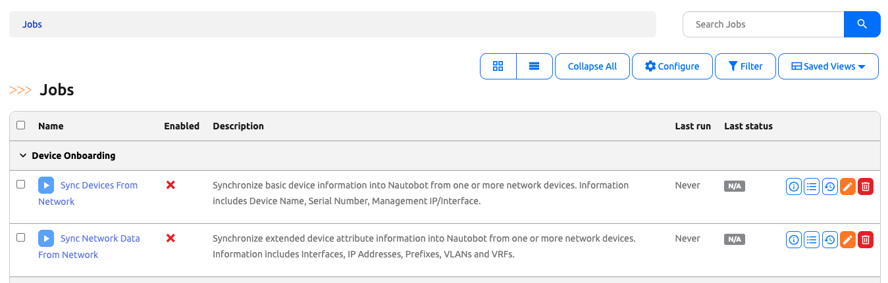
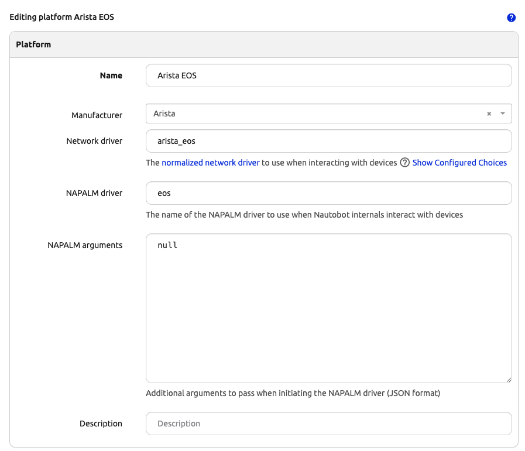
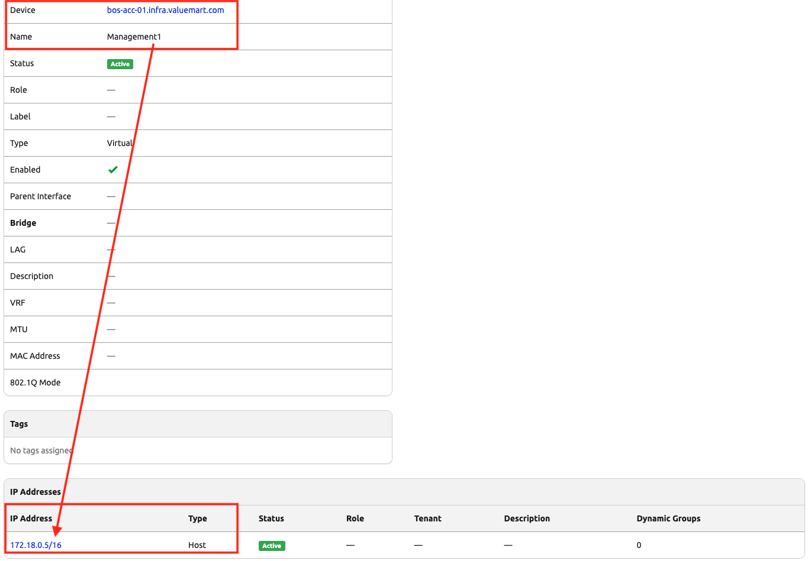

# Day 3: Run the Onboarding Job

Today is the payoff. We run Device Onboarding's job against `bos-rtr-01` first to inspect what it creates, then batch the remaining three cEOS devices.

## Look Up cEOS Container IPs

Containerlab's bridge network assigns IPs dynamically, so we look them up at run-time rather than hard-coding.

```
$ sudo containerlab inspect --topo clab/ceos-lab.clab.yml
```

Note the IPv4 address of each node. For the rest of this Day we will use `bos-rtr-01`'s address; replace with whatever yours shows.

## Find the Onboarding Job

In the Nautobot UI:

- **Jobs** → **Jobs** → filter for "onboarding".

You should see one visible job from `nautobot_device_onboarding`:

- **Sync Devices From Network** — the SSoT-based job that uses Nornir + the SecretsGroup we created on Day 2.



> [!NOTE]
> Device Onboarding 4.x still ships the legacy `Perform Device Onboarding (Original)` job, but it is marked hidden and does not appear in the UI's job list by default. We use the SSoT-based job in this lab.

## Enable the Job

Nautobot installs Jobs in a disabled state by default — you have to flip the `Enabled` flag once before the **Run Job Now** button appears.

- Click into **Sync Devices From Network**.
- Hit **Edit** (top-right) → tick **Enabled** → **Update**.

You should now see **Run Job Now** on the job's detail page.

## Verify the `arista_eos` Platform driver

Device Onboarding 4.x maps each `show ...` command's output to Nautobot fields using a **platform-specific mapper** (a YAML keyed off the Platform's `network_driver`). If the driver string is wrong or missing, the job will SSH in, run all the commands, and then fail to extract anything — every field comes back as a missing key.

Leaving **Platform** empty on the job form means Device Onboarding tries to *auto-detect* the platform from the command output. In practice this is brittle for Arista cEOS in this lab, so we'll pre-stage the Platform and pick it explicitly in the next step.

Navigate to **Devices → Platforms**. Look for `arista_eos`:

- If it does **not** exist, click **+ Add** and create one. The critical field is **Network Driver** — it must be exactly `arista_eos` (lowercase, with underscore). Also set **NAPALM Driver** = `eos`.
- If it already exists (Scenario 1's seed data usually ships it), click into it and confirm **Network Driver** = `arista_eos`. Edit if needed.



## Patch the `arista_eos_show_version` TextFSM template for cEOS

Device Onboarding's `arista_eos` mapper parses `show version` output using the `ntc-templates` package's `arista_eos_show_version.textfsm` template. That template was designed for real Arista EOS hardware and has a strict `^. -> Error` catch-all rule at the end — any line that doesn't match an earlier rule raises a `TextFSMError`. **Containerlab's cEOS image adds two lines that real EOS doesn't emit:**

```
cEOS tools version: (unknown)
Kernel version: 6.8.0-1044-azure
```

When the parser hits the first one, it raises, Device Onboarding catches silently, and you see this in the job log:

```
Unable to onboard <ip>, returned data missing for ['device_type', 'hostname', 'mgmt_interface', 'mask_length', 'serial', 'platform']
```

Patch the template in the celery_worker container (`-u 0` runs as root to write into `/usr/local/lib/...`):

```
$ docker exec -u 0 -i nautobot-docker-compose-celery_worker-1 python <<'PYEOF'
import ntc_templates, os
path = os.path.dirname(ntc_templates.__file__) + '/templates/arista_eos_show_version.textfsm'
text = open(path).read()
if 'cEOS' not in text:
    new_rules = (
        '  ^cEOS\\s+tools\\s+version:.*\n'
        '  ^Kernel\\s+version:.*\n'
        '  ^. -> Error'
    )
    text = text.replace('  ^. -> Error', new_rules)
    open(path, 'w').write(text)
    print('PATCHED')
else:
    print('ALREADY PATCHED')
PYEOF
```

The patch inserts two **silent skip** rules (a rule with a pattern but no `-> Action` consumes the line and continues) right before the Error catch-all. After this, `parse_output(platform='arista_eos', command='show version', data=<cEOS output>)` returns a populated dict instead of raising.

> ⚠️ Like the network-bridge step in Day 2, this TextFSM patch lives in the container's filesystem and is **lost** any time the containers are recreated — `invoke stop` + `invoke debug`, `invoke build` + `invoke debug`, codespace machine-type change. After any such recreation, re-apply **both** the Day 2 bridge attachments **and** this patch, or the next onboarding job will fail to connect or to parse `show version`.
>
> Easiest — the one-shot helper does both:
>
> ```
> $ bash ~/100-days-of-nautobot/Nautobot_App_1_Device_Onboarding/scripts/patch_lab_ceos.sh
> ```
>
> If you need the bridge commands explicitly:
>
> ```
> $ docker network connect bridge nautobot-docker-compose-celery_worker-1
> $ docker network connect bridge nautobot-docker-compose-nautobot-1
> $ docker network connect bridge nautobot-docker-compose-celery_beat-1
> ```

## Run the Job Against One Device

Click **Sync Devices From Network** → **Run Job Now**. The form has many fields; here is what to set (everything else can stay at its default):

| Field | Set to |
|-------|--------|
| **Dryrun** | **uncheck** — leaving this checked means the job runs but does not actually create anything in Nautobot, which is the opposite of what we want today |
| **Debug** | leave unchecked |
| **Connectivity test** | leave unchecked (the job will SSH to verify regardless) |
| **CSV file** | leave empty (we use IP Addresses instead) |
| **Location** | `East Coast → Boston` (the dropdown shows the parent path; pick the nested Boston) |
| **Namespace** | `Global` (or your install's default) |
| **IP Addresses** | the IPv4 of `bos-rtr-01` from `containerlab inspect` |
| **Port** | `22` |
| **Timeout** | `30` |
| **Set mgmt only** | leave at default (True) |
| **Update devices without primary IP** | leave at default (False) |
| **Device role** | `network` (from Day 2) |
| **Device status** | `Active` |
| **Interface status** | `Active` |
| **IP address status** | `Active` |
| **Secrets group** | `cEOS Lab Credentials` (from Day 2) |
| **Platform** | `arista_eos` — explicit, not auto-detect (see the previous section for why) |

Click **Run**. The job redirects to its log view; refresh until it completes.

## Inspect What Was Created

After a successful run, browse:

- **Devices** → **Devices** — `bos-rtr-01` should appear, status Active, role network, in Boston.
- The device detail page should show its **Manufacturer** (Arista), **Platform** (`arista_eos`), **Serial number** (from cEOS), and the **management interface** with its IP set as the **Primary IPv4**.



> [!IMPORTANT]
> **Verify the Primary IPv4 matches the Containerlab IP** for the same device — the address you ran the job against, and what `sudo containerlab inspect --topo clab/ceos-lab.clab.yml` showed back on [Day 2](../Day_02_Pre_Onboarding_Data/README.md#verify-the-ips). If those two do not match, something went wrong (you onboarded against the wrong IP, or the Containerlab IPs shifted since Day 2). The whole point of Device Onboarding is for Nautobot to mirror the device — so the IPs have to be identical.

> [!NOTE]
> **Sync Devices From Network only populates the management interface and primary IP.** Full interface inventory, VLANs, VRFs, and cables come from a *second* job — `Sync Network Data From Network`. Day 4 walks that step.

## Batch the Rest

Re-run the same job with all four IPs in one go. **IP Addresses** is a comma-separated `StringVar`, so you can paste:

```
<bos-acc-01-ip>, <bos-rtr-01-ip>, <nyc-acc-01-ip>, <nyc-rtr-01-ip>
```

Adjust **Location** as appropriate — if all four belong to different sites, you may need to run the job once per Location. For the Boston pair, set Location = Boston and pass both Boston IPs; repeat with New York for the NYC pair.

## Day 3 To Do

Remember to stop the codespace instance on [https://github.com/codespaces/](https://github.com/codespaces/). 

Go ahead and post a screenshot of your first onboarded cEOS device's detail page (manufacturer, platform, management interface, primary IP all populated) on social media of your choice, make sure you use the tag `#100DaysOfNautobot` `#JobsToBeDone` and tag `@networktocode`, so we can share your progress! 

In tomorrow's challenge, we will [populate the full interface inventory](../Day_04_Validate_And_Wrap/README.md) with **Sync Network Data From Network**, watch idempotency on a re-run, and close out with real-world correlation. See you tomorrow! 

[X/Twitter](<https://twitter.com/intent/tweet?url=https://github.com/nautobot/100-days-of-nautobot&text=I+just+completed+Day+3+of+the+Device+Onboarding+expansion+pack+of+the+100+days+of+nautobot+challenge+!&hashtags=100DaysOfNautobot,JobsToBeDone>)

[LinkedIn](https://www.linkedin.com/) (Copy & Paste: I just completed Day 3 of the Device Onboarding expansion pack of 100 Days of Nautobot, https://github.com/nautobot/100-days-of-nautobot, challenge! @networktocode #JobsToBeDone #100DaysOfNautobot)
