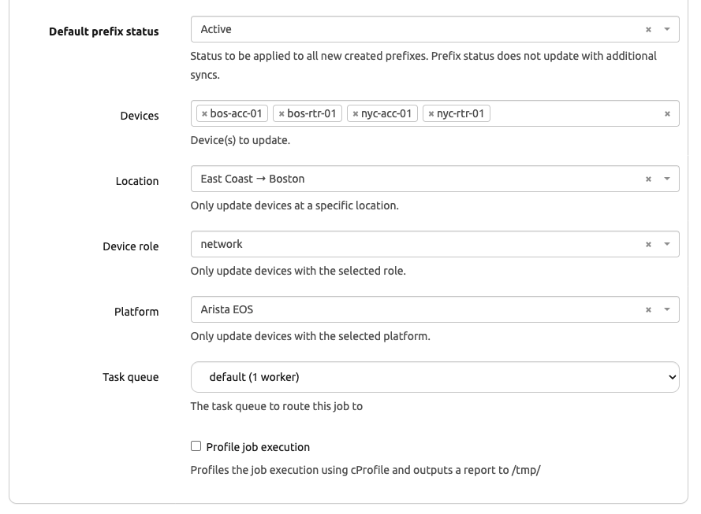

# Day 4: Validate and Wrap

The four cEOS devices are now real Devices in Nautobot, but only their management interface is populated. Today we pull in the rest (interfaces, VLANs, VRFs) with a second job, cross-check what landed, watch idempotency on a re-run, and close out.

## Enable the Job

Just like `Sync Devices From Network` on Day 3, this second job ships disabled and won't show a **Run Job Now** button until you flip its Enabled flag.

- **Jobs → Jobs** → click into **Sync Network Data From Network**.
- Hit **Edit** (top-right) → tick **Enabled** → **Update**.

## Populate Full Interface Data

The `Sync Devices From Network` job from Day 3 onboarded the device, its platform, and the management interface. To populate the **rest** of each device's interfaces (plus VLANs, VRFs, and cabling) we run a second job: **Sync Network Data From Network**.

In the UI:

- **Jobs → Jobs → Sync Network Data From Network → Run Job Now**.
- Select the onboarded device(s) from the **Devices** picker (or pass them via filter). If you only completed Day 3 against `bos-rtr-01`, just pick that one — the job works on a single device.
- **Sync VLANs**, **Sync VRFs**, **Sync Cables** — leave at their defaults. The cEOS devices in this lab have all three to pick up.
- Click **Run**.



After the job completes, the Device detail pages should show their full interface list (Ethernet1, Ethernet2, …) with link types, VLANs, and IPs as configured on the cEOS side.

## Cross-Check the Populated Data

Pick `bos-rtr-01`. Compare what Nautobot has against `show version` and `show interfaces` on the actual cEOS container.

```
$ ssh admin@<bos-rtr-01-ip>
ceos-01> show version
ceos-01> show interfaces
```

In the Nautobot UI, open the matching Device. Verify:

| Field | Should match |
|-------|--------------|
| Hostname | `show version` system hostname |
| Manufacturer | Arista |
| Platform | `arista_eos` |
| Serial | `show version` serial |
| Management interface | the interface you onboarded against, marked as primary |
| Other interfaces | one row per `show interfaces` entry (after running Sync Network Data) |
| Primary IPv4 | the management IP we onboarded against |

## Idempotency Re-Run

Re-run both jobs (`Sync Devices From Network`, then `Sync Network Data From Network`) with the same inputs. The job logs should show "no changes" for each device (or only diff-driven updates). Confirm in the UI that no duplicate Devices, Interfaces, or VLANs were created.

## Change Something Upstream, Re-Run

SSH into `bos-rtr-01` and change its hostname:

```
ceos-01> enable
ceos-01# config terminal
ceos-01(config)# hostname bos-rtr-01-new
```

Re-run the job for that IP. Observe in the Nautobot UI that the Device's Name updated. This is the value Device Onboarding adds in production — your Nautobot stays a faithful mirror as devices change.

## Real-World Correlation

The lab boils down a real-world onboarding flow:

- **Credentials live in Nautobot Secrets, not in code.** The same SecretsGroup pattern you set up here scales to production secrets backends (Vault, AWS Secrets Manager) — only the *provider* changes.
- **The job is idempotent.** That means it's safe to schedule (e.g. nightly) so Nautobot reflects whatever's currently on the network, even when devices change without your knowing.
- **Containerlab is a stand-in for real network gear.** Replace the cEOS IPs with your actual data-center management IPs, and the same job onboards real hardware. Nothing about the Nautobot-side workflow changes.
- **Batching scales.** Production onboarding usually feeds the IPs from a CSV, an IPAM query, or another SoT. Look at the **Bulk Onboarding** flow in the Device Onboarding docs once you outgrow the per-run form.

## Wrap-up

You have:

- Installed a real-world Nautobot App against the Scenario 1 base.
- Wired the dependency chain (Device Onboarding → SSoT → Nornir → Nautobot Secrets).
- Onboarded four lab devices into Nautobot end-to-end.
- Seen the job behave idempotently and pick up upstream changes.

The Retail-r-Us network in your Codespace is now backed by a Source of Truth that mirrors reality.

## Day 4 To Do

Remember to stop the codespace instance on [https://github.com/codespaces/](https://github.com/codespaces/). 

Go ahead and post a screenshot of a device's fully-populated interface list, or share one lesson learned about idempotency and real-world onboarding, on social media of your choice, make sure you use the tag `#100DaysOfNautobot` `#JobsToBeDone` and tag `@networktocode`, so we can share your progress! 

This wraps the **Device Onboarding** expansion pack. A future expansion pack will likely cover **Golden Config** — the next step after you have devices in Nautobot is generating, comparing, and deploying their intended configurations. Keep an eye on this repo. See you in the next pack! 

[X/Twitter](<https://twitter.com/intent/tweet?url=https://github.com/nautobot/100-days-of-nautobot&text=I+just+completed+Day+4+of+the+Device+Onboarding+expansion+pack+of+the+100+days+of+nautobot+challenge+!&hashtags=100DaysOfNautobot,JobsToBeDone>)

[LinkedIn](https://www.linkedin.com/) (Copy & Paste: I just completed Day 4 of the Device Onboarding expansion pack of 100 Days of Nautobot, https://github.com/nautobot/100-days-of-nautobot, challenge! @networktocode #JobsToBeDone #100DaysOfNautobot)
