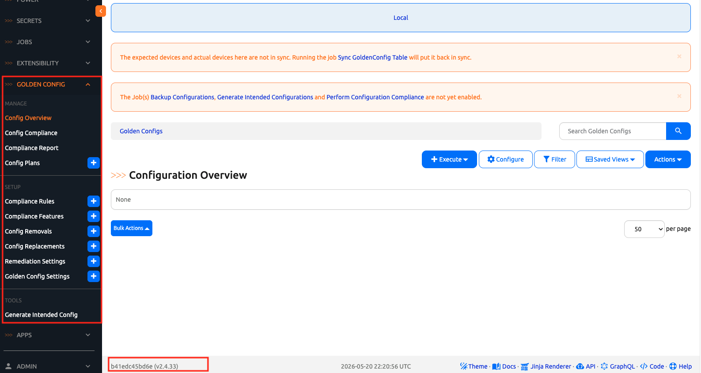

# Day 1: Upgrade Nautobot, then Install Golden Config

Today is two phases:

1. **Upgrade** the Nautobot stack from 2.3.2 / Python 3.8 to 2.4.33 / Python 3.12. Golden Config's current 2.x line (2.6.x) requires Nautobot ≥ 2.4.20 — staying on 2.3.2 would force us onto Golden Config 2.3.0, which is older and missing recent UX. One hop forward gets us the modern stack.
2. **Install** `nautobot-golden-config` and wire it into `PLUGINS` / `PLUGINS_CONFIG`.

By the end of today, the app is loaded, migrations are applied, and the **Apps → Golden Configuration** menu appears in the UI.

## Phase 1 — Upgrade Nautobot 2.3.2 → 2.4.33

The [3.1 Upgrade Lab Day 1](../../Nautobot_3_1_Upgrade_Lab/Day_01_Upgrade/README.md) walks the full 2.3.2 → 3.1.2 path in three hops. We only need its **first** hop (2.3.2 → 2.4.33). Stop after Hop 1 — do **not** continue to 3.0 / 3.1, because Golden Config 2.x targets Nautobot 2.x.

For the full reasoning behind each step, read [Hop 1 in the Upgrade Lab](../../Nautobot_3_1_Upgrade_Lab/Day_01_Upgrade/README.md#hop-1-232--2433-also-python-38--312). The condensed commands you need to run are below.

### Snapshot the DB first

```
$ cd ~/nautobot-docker-compose
$ docker exec nautobot-docker-compose-db-1 pg_dump -h localhost -d nautobot -U nautobot > nautobot.sql
```

### Edit `pyproject.toml`

Three changes:

```toml
[tool.poetry]
name = "nautobot-docker-compose"
version = "0.1.1"
package-mode = false   # NEW — required for Poetry 2.x in the 2.4 build image

[tool.poetry.dependencies]
# old: python = ">=3.9,<3.12"
python = ">=3.10,<3.13"

# old: nautobot = "2.3.2"
nautobot = "2.4.33"
```

### Edit `environments/Dockerfile`

In the existing `RUN cd /source && poetry install ...` block, add the `poetry self add poetry-plugin-export` line so the build image gets the Poetry-2.x export plugin:

```dockerfile
RUN cd /source && \
    poetry install --no-interaction --no-ansi && \
    poetry self add poetry-plugin-export || true && \
    mkdir /tmp/dist && \
    poetry export --without-hashes -o /tmp/dist/requirements.txt
```

### Edit `invoke.yml`

You created `invoke.yml` during Device Onboarding Day 1 with `python_ver: "3.10"`. Bump it to `"3.12"`:

```yaml
nautobot_docker_compose:
  python_ver: "3.12"     # was "3.10"
  # ... other entries unchanged
```

> ℹ️ The 3.1 Upgrade Lab Day 1 edits `tasks.py` for this same value — it doesn't have an `invoke.yml`. We do (from DO Day 1), and `invoke.yml`'s value **overrides** anything in `tasks.py`. So we only need to edit `invoke.yml`; `tasks.py`'s long-standing `"3.8"` default is moot for us.

### Rebuild and migrate

```
$ poetry lock
$ invoke stop
$ docker pull ghcr.io/nautobot/nautobot:2.4.33-py3.12
$ docker pull ghcr.io/nautobot/nautobot-dev:2.4.33-py3.12
$ invoke build         # several minutes — uses the pre-pulled base images above
$ invoke start
$ docker exec nautobot-docker-compose-nautobot-1 nautobot-server migrate dcim --fake
$ invoke migrate
$ invoke post-upgrade
```

The `--fake dcim` step reconciles seed-data drift in the Scenario 1 starter dump — without it, `invoke migrate` will try to add columns the database already has.

### Verify

```
$ docker exec nautobot-docker-compose-nautobot-1 nautobot-server --version
Nautobot version: 2.4.33

$ docker exec nautobot-docker-compose-nautobot-1 python --version
Python 3.12.x
```

## Phase 2 — Install Golden Config

### Step 1 — Add `nautobot-golden-config` as a Poetry dependency

Now that we are on Nautobot 2.4.33, the current 2.6.x line of Golden Config is what we want. Pin to the 2.6 line specifically:

```
(nautobot-docker-compose-py3.10) $ poetry shell
(nautobot-docker-compose-py3.10) $ poetry add 'nautobot-golden-config@~2.6'
```

`~2.6` resolves to `>=2.6.0, <3.0.0` in Poetry — currently picks 2.6.4 (the latest 2.x). Transitive deps pulled in: `hier-config`, `matplotlib`, `deepdiff`, `django-pivot`, `xmldiff`, `nautobot-capacity-metrics`, `netutils`, `toml`. `nautobot-plugin-nornir` is already installed by Device Onboarding.

### Step 2 — Wire into `nautobot_config.py`

Edit `config/nautobot_config.py`. **Append** `nautobot_golden_config` to the existing `PLUGINS` list (do not replace — Device Onboarding's three entries must stay) and add the `PLUGINS_CONFIG` block:

```python
PLUGINS = [
    "nautobot_plugin_nornir",
    "nautobot_ssot",
    "nautobot_device_onboarding",
    "nautobot_golden_config",   # NEW
]

PLUGINS_CONFIG = {
    # ... existing entries from Device Onboarding ...
    "nautobot_golden_config": {
        "enable_backup": True,
        "enable_compliance": True,
        "enable_intended": True,
        "enable_sotagg": True,
    },
}
```

We will use `backup`, `intended`, and `compliance` on Days 3 and 4. `sotagg` (SOT aggregation) is left on so the Jinja templates we write on Day 2 have the option of pulling richer GraphQL context if we extend them later.

### Step 3 — Rebuild the image (again, with GC this time)

```
(nautobot-docker-compose-py3.10) $ invoke stop
(nautobot-docker-compose-py3.10) $ invoke build
```

### Step 4 — Start the stack, then re-apply the lab patches

```
(nautobot-docker-compose-py3.10) $ invoke debug
```

In a **second terminal**, re-apply the Containerlab compatibility patches (the previous containers were destroyed by `invoke stop`, so the runtime patches we applied during Device Onboarding are gone):

```
$ cd ~/100-days-of-nautobot
$ bash Nautobot_App_1_Device_Onboarding/scripts/patch_lab_ceos.sh
```

The script bridges the Nautobot containers onto Containerlab's network, patches the `arista_eos_show_version` TextFSM template, and patches the `arista_eos.yml` mapper YAML's hostname entry. Same patches Golden Config will need on Day 3 when its Backup job SSH's into the cEOS devices via Nornir.

### Step 5 — Apply Golden Config migrations

Still in the second terminal:

```
$ cd ~/nautobot-docker-compose
$ poetry shell
(nautobot-docker-compose-py3.10) $ invoke post-upgrade
```

Look for `nautobot_golden_config` in the migrations list — those are the Golden Config tables (Compliance Rules, Compliance Features, Settings, ConfigPlans, etc.) being created.

### Step 6 — Verify in the UI

Open the Nautobot UI on port 8080. The footer should show **v2.4.33** now. Under **Apps → Installed Apps**, you should now see four apps:

- `Nautobot Plugin for Nornir`
- `Single Source of Truth`
- `Device Onboarding`
- `Golden Configuration` ← new

The left nav should also gain a new top-level **Apps → Golden Configuration** group with sub-items like:

- **Compliance**
  - Configuration Compliance
  - Compliance Rules
  - Compliance Features
- **Configuration**
  - Config Overview
  - Backup
  - Intended
  - Config Plans
- **Settings**
  - Golden Config Settings
  - Remediation Settings



We will configure **Golden Config Settings** on Day 2.

## Day 1 To Do

Remember to stop the codespace instance on [https://github.com/codespaces/](https://github.com/codespaces/).

Go ahead and post a screenshot of your new Nautobot 2.4.33 footer + the **Apps → Golden Configuration** menu in your Nautobot UI on social media of your choice, make sure you use the tag `#100DaysOfNautobot` `#JobsToBeDone` and tag `@networktocode`, so we can share your progress!

In tomorrow's challenge, we will [set up the templates Git repository and Golden Config Settings](../Day_02_Templates_And_Settings/README.md) — the per-Platform wiring that tells Golden Config where to read Jinja templates from and where to write backups / intended configs. See you tomorrow!

[X/Twitter](<https://twitter.com/intent/tweet?url=https://github.com/nautobot/100-days-of-nautobot&text=I+just+completed+Day+1+of+the+Golden+Config+expansion+pack+of+the+100+days+of+nautobot+challenge+!&hashtags=100DaysOfNautobot,JobsToBeDone>)

[LinkedIn](https://www.linkedin.com/) (Copy & Paste: I just completed Day 1 of the Golden Config expansion pack of 100 Days of Nautobot, https://github.com/nautobot/100-days-of-nautobot, challenge! @networktocode #JobsToBeDone #100DaysOfNautobot)
