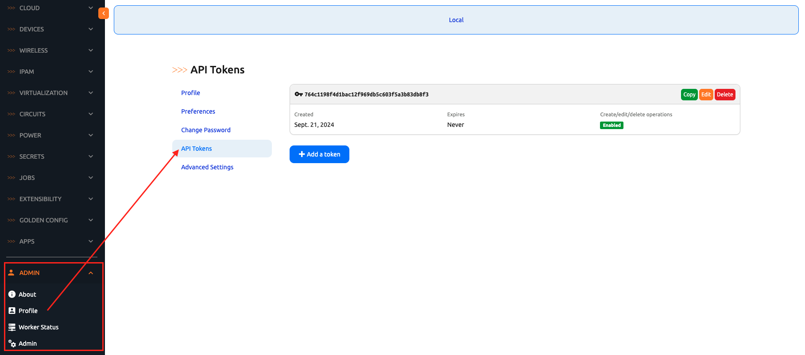
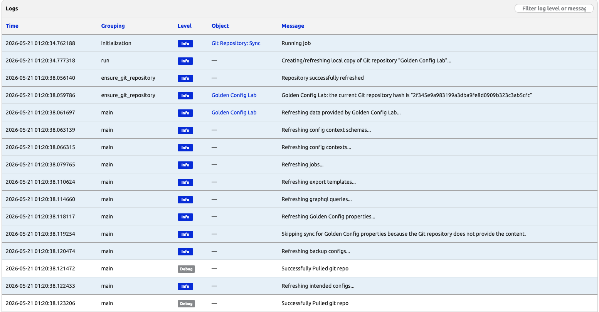
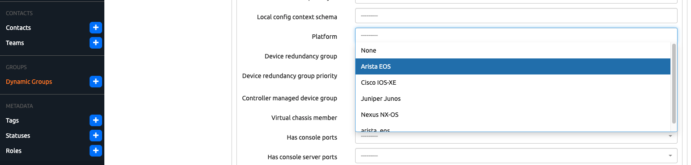

# Day 2: Seed mock Devices, then wire Templates and Golden Config Settings

Today is three blocks:

1. **Seed** four mock cEOS Devices into Nautobot via the pack's REST-API script — these are what every Golden Config job will operate against from now on.
2. **Wire** a Nautobot GitRepository that holds the Jinja templates and the pre-committed sample backups. One repo, three roles (templates / backups / intended).
3. **Configure** Golden Config Settings that tie the templates + repo paths + DynamicGroup scope together.

## Where the templates and backups live

The pack ships a [`golden-config-data/`](../golden-config-data/) scaffold at the root of this expansion pack:

```
Nautobot_App_2_Golden_Config/golden-config-data/
├── README.md                          # explains the structure
├── templates/
│   └── arista_eos/
│       └── network.j2                 # intended-config template for cEOS devices in the "network" role
├── backups/                           # pre-committed sample running-configs (the GC Backup job would write here in production)
│   ├── Boston/
│   │   ├── bos-acc-01.cfg
│   │   └── bos-rtr-01.cfg
│   └── New_York/
│       ├── nyc-acc-01.cfg
│       └── nyc-rtr-01.cfg
└── intended/                          # populated by GC's Generate Intended Configurations job on Day 4
    └── .gitkeep
```

Golden Config reads templates from this scaffold to render intended configurations, and reads the pre-committed sample backups to compare against in Day 4's compliance run. The `intended/` subdir is populated locally inside the Nautobot container on Day 4 — no Secrets Group on the GitRepository, so it never pushes back upstream.

## Step 0 — Seed the four mock cEOS Devices

Open a second terminal in the Codespace (leave the first terminal running `invoke debug` from Day 1). Install `pynautobot`:

```
$ pip install pynautobot
```

The seed script hits Nautobot's REST API, so it needs an admin API token. The Lab Scenario 1 baseline does **not** wire one up for you out of the box — `creds.env` sets `NAUTOBOT_CREATE_SUPERUSER=false`, which means the admin user comes from the imported Scenario 1 SQL dump rather than from the env-var defaults, and the `NAUTOBOT_SUPERUSER_API_TOKEN` value in `creds.env` is never written into the database. Trying to run the script without overriding the token gets you `403 Forbidden: Invalid token`.

Grab your admin user's actual API token from the UI:

1. Log in to the Nautobot UI as `admin / admin`.
2. Top-right user dropdown → **Profile**.
3. **API Tokens** tab → click **+ Add** to create a new token (leave the expiry blank for the lab) → **Create**.
4. Copy the token key shown on the next page — that is the only time the full key is displayed.



Now run the seed script with that token exported in front of the command:

```
$ NAUTOBOT_TOKEN=<paste-your-token-here> \
    python ~/100-days-of-nautobot/Nautobot_App_2_Golden_Config/scripts/seed_mock_devices.py
```

The script is **idempotent** — re-running it is safe; it prints `already present, leaving as-is` for any object that exists. It creates:

- LocationType `Site`
- Locations `Boston` and `New York`
- Role `network`
- Manufacturer `Arista`, Platform `arista_eos` (network_driver `arista_eos`), DeviceType `cEOS Lab`
- Devices: `bos-acc-01` + `bos-rtr-01` in Boston; `nyc-acc-01` + `nyc-rtr-01` in New York

Verify in the Nautobot UI at **Devices → Devices** — all four should be listed with Platform `arista_eos`, Role `network`, Status `Active`.

> 💡 The script also reads `NAUTOBOT_URL` from the environment if set, defaulting to `http://localhost:8080` (correct for a fresh Codespace from this repo's Lab Scenario 1 config). Override only if your Nautobot is reachable at a different URL.

## Step 1 — Create the GitRepository in Nautobot

In the Nautobot UI, navigate to **Extensibility → Git Repositories → Add**:

| Field | Value |
|-------|-------|
| **Name** | `Golden Config Lab` |
| **Slug** | `golden_config_lab` (auto-fills from the Name field) |
| **Remote URL** | `https://github.com/nautobot/100-days-of-nautobot.git` |
| **Branch** | `main` |
| **Provided Contents** | tick all three: `backup configs`, `intended configs`, `jinja templates` (the dropdown also shows `Golden Config properties` — leave that one unticked; we wire Settings through the UI in Step 3, not via Git) |

> 💡 **Selecting multiple Provided Contents entries:** the field is a standard HTML multi-select, so hold **⌘ Command** (macOS) or **Ctrl** (Windows / Linux) while clicking the second and third entries to keep prior selections. Clicking without the modifier replaces your current selection with just the clicked entry.

Leave **Secrets Group** empty — public repo, no credentials needed, no pushes.

Click **Create & Sync** — this saves the repository and triggers the initial Git fetch in one step. Watch the job log; on success, the GitRepository's status flips to `OK`. (Plain **Create** saves without fetching; you would then have to trigger the fetch manually via the `Sync` action top-right.)



## Step 2 — Create a DynamicGroup to scope Golden Config to the mock cEOS Devices

Golden Config's Settings use a DynamicGroup as their scope — only Devices matching the group get rendered (Intended) and checked (Compliance).

The Nautobot 2.4 UI creates the group in two passes: first define the group itself (Name + Content Type), then come back to apply the filter. The filter builder cannot present field options until it knows which model it is filtering, so the Content Type has to land first.

Navigate to **Organization → Dynamic Groups → Add**:

| Field | Value |
|-------|-------|
| **Name** | `cEOS Lab Devices` |
| **Content Type** | `dcim \| device` |

Click **Create**. You will land on the new group's detail page with an empty Members tab.

Now apply the filter — click **Edit** on the detail page and use the filter builder to set `Platform = arista_eos`, then save. The DynamicGroup's **Members** tab should now list the four mock cEOS Devices (`bos-acc-01`, `bos-rtr-01`, `nyc-acc-01`, `nyc-rtr-01`).



## Step 3 — Configure Golden Config Settings

Navigate to **Apps → Golden Configuration → Golden Config Settings → Add**:

| Field | Value |
|-------|-------|
| **Name** | `cEOS Lab Settings` |
| **Slug** | `ceos_lab_settings` (same identifier rule as Step 1 — replace any auto-filled dashes with underscores) |
| **Weight** | `1000` |
| **Description** | `Backup + intended + compliance for the four mock cEOS Devices` |
| **Scope** | `cEOS Lab Devices` (the DynamicGroup from Step 2) |
| **Backup Repository** | `Golden Config Lab` |
| **Backup Path Template** | `Nautobot_App_2_Golden_Config/golden-config-data/backups/{{ obj.location.name \| replace(' ', '_') }}/{{ obj.name }}.cfg` |
| **Intended Repository** | `Golden Config Lab` |
| **Intended Path Template** | `Nautobot_App_2_Golden_Config/golden-config-data/intended/{{ obj.location.name \| replace(' ', '_') }}/{{ obj.name }}.cfg` |
| **Jinja Repository** | `Golden Config Lab` |
| **Jinja Path Template** | `Nautobot_App_2_Golden_Config/golden-config-data/templates/{{ obj.platform.network_driver }}/{{ obj.role.name }}.j2` |

The path templates are themselves Jinja — `obj` is the Device. The `replace(' ', '_')` filter turns the Location name `New York` into `New_York` so the resulting filesystem paths have no spaces (matching the `New_York/` directory in the scaffold). For `bos-acc-01` (location `Boston`, role `network`, platform `arista_eos`):

- Backup → `Nautobot_App_2_Golden_Config/golden-config-data/backups/Boston/bos-acc-01.cfg`
- Intended → `Nautobot_App_2_Golden_Config/golden-config-data/intended/Boston/bos-acc-01.cfg`
- Template → `Nautobot_App_2_Golden_Config/golden-config-data/templates/arista_eos/network.j2`

Leave the **Backup Test** field empty (we will not run the Backup job in this lab anyway — see Day 3). Leave the GraphQL **SoT Aggregation Query** field empty for now.

Save.

## Step 4 — Validate the wiring

On the **Golden Config Settings** detail page (`cEOS Lab Settings`), each repository link should be clickable and resolve. Click into the **Scope** DynamicGroup — the four mock cEOS Devices should be listed.

Quick sanity-check from the codespace shell — confirm the local clone of the GitRepository inside the Nautobot container has both the template and the four sample backups in the right places:

```
$ docker exec nautobot-docker-compose-nautobot-1 \
    ls /opt/nautobot/git/golden_config_lab/Nautobot_App_2_Golden_Config/golden-config-data/templates/arista_eos/
network.j2

$ docker exec nautobot-docker-compose-nautobot-1 \
    ls /opt/nautobot/git/golden_config_lab/Nautobot_App_2_Golden_Config/golden-config-data/backups/Boston/
bos-acc-01.cfg
bos-rtr-01.cfg

$ docker exec nautobot-docker-compose-nautobot-1 \
    ls /opt/nautobot/git/golden_config_lab/Nautobot_App_2_Golden_Config/golden-config-data/backups/New_York/
nyc-acc-01.cfg
nyc-rtr-01.cfg
```

If all three listings come back as expected, every path template will resolve at job runtime. Day 3 walks through the backups; Day 4 generates intended configs and compares them against the backups.

## Day 2 Recap

| What | State after Day 2 |
|------|-------------------|
| Mock Devices in Nautobot | 4 (`bos-acc-01`, `bos-rtr-01`, `nyc-acc-01`, `nyc-rtr-01`) |
| Templates scaffold | committed at `golden-config-data/templates/arista_eos/network.j2` |
| Pre-committed sample backups | 4 at `golden-config-data/backups/{Boston,New_York}/*.cfg` |
| GitRepository in Nautobot | `Golden Config Lab` synced, all three `provided_contents` ticked |
| DynamicGroup | `cEOS Lab Devices` scoped to Platform = `arista_eos` (4 members) |
| Golden Config Settings | `cEOS Lab Settings` wiring repo + paths + scope |
| Intended configs | dir empty — Day 4 will fill it |

## Day 2 To Do

Remember to stop the codespace instance on [https://github.com/codespaces/](https://github.com/codespaces/).

Go ahead and post a screenshot of your `cEOS Lab Settings` Golden Config Settings page (showing the wired repository + scope + path templates) on social media of your choice, make sure you use the tag `#100DaysOfNautobot` `#JobsToBeDone` and tag `@networktocode`, so we can share your progress!

In tomorrow's challenge, we will [walk through how Golden Config's **Backup Configurations** job works in production and inspect the pre-committed sample running-configs](../Day_03_Backup_Configurations/README.md) we shipped in this pack's `golden-config-data/backups/` scaffold. See you tomorrow!

[X/Twitter](<https://twitter.com/intent/tweet?url=https://github.com/nautobot/100-days-of-nautobot&text=I+just+completed+Day+2+of+the+Golden+Config+expansion+pack+of+the+100+days+of+nautobot+challenge+!&hashtags=100DaysOfNautobot,JobsToBeDone>)

[LinkedIn](https://www.linkedin.com/) (Copy & Paste: I just completed Day 2 of the Golden Config expansion pack of 100 Days of Nautobot, https://github.com/nautobot/100-days-of-nautobot, challenge! @networktocode #JobsToBeDone #100DaysOfNautobot)
