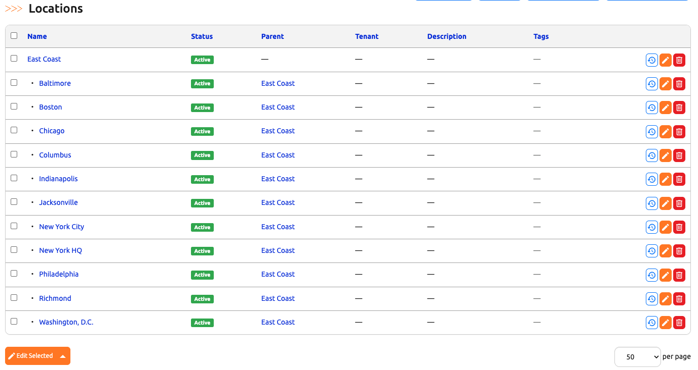
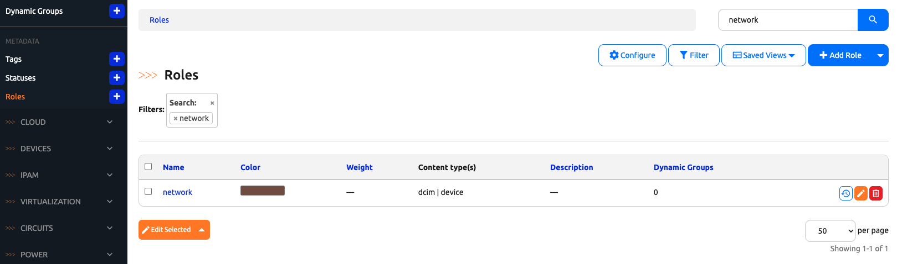
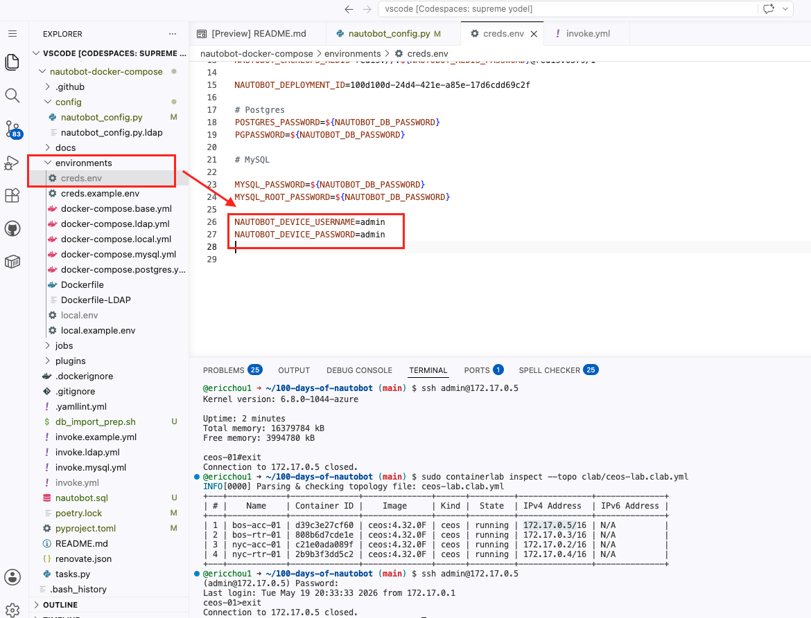

# Day 2: Pre-Onboarding Data

Device Onboarding does not invent your data model — it populates an existing one. Today we set up the scaffolding the onboarding job expects: **Locations**, **Statuses**, **Roles**, and a **SecretsGroup** carrying the cEOS `admin` / `admin` credentials.

We also spin up the Containerlab cEOS topology, since Day 3 will point the job at those devices.

## Bring up Containerlab

If the cEOS topology is not already running, the relevant pieces of [Lab Setup Scenario 1](../../Lab_Setup/scenario_1_setup/README.md) are reposted below so you do not need to bounce between docs.

### One-time cEOS image upload (skip if already done)

Containerlab needs the Arista cEOS image imported into Docker. The image itself is a free Arista download (business email required for registration). See [Lab Setup Scenario 1 → Download and Upload cEOS image](../../Lab_Setup/scenario_1_setup/README.md#download-and-upload-ceos-image) for the registration + upload UI flow.

Once the `.tar` file is in your Codespace, import it (substitute the version and path to match what you downloaded):

```
$ docker import ~/cEOS64-lab-4.32.0F.tar ceos:4.32.0F
sha256:ff28abebb338b16656c0c86e01940e97a3b26de4b6c66873daebdb941cd4f4e2
```

The tag (`ceos:4.32.0F`) must match the `image:` field in `clab/ceos-lab.clab.yml`.

### Deploy the topology

Today we want all four devices (the full Boston + NYC fabric), so launch without a `--node-filter`:

```
$ cd ~/100-days-of-nautobot
$ sudo containerlab deploy --topo clab/ceos-lab.clab.yml
```

After ~90 seconds, you should see a four-row table:

```
+---+------------+--------------+--------------+------+---------+---------------+
| # |    Name    | Container ID |    Image     | Kind |  State  | IPv4 Address  |
+---+------------+--------------+--------------+------+---------+---------------+
| 1 | bos-acc-01 | 575cba7b555b | ceos:4.32.0F | ceos | running | 172.17.0.3/16 |
| 2 | bos-rtr-01 | 940e991b876a | ceos:4.32.0F | ceos | running | 172.17.0.2/16 |
| 3 | nyc-acc-01 | ...          | ceos:4.32.0F | ceos | running | 172.17.0.4/16 |
| 4 | nyc-rtr-01 | ...          | ceos:4.32.0F | ceos | running | 172.17.0.5/16 |
+---+------------+--------------+--------------+------+---------+---------------+
```

These are the four devices we will onboard on Day 3:

| Hostname | Role hint | Location |
|----------|-----------|----------|
| `bos-acc-01` | access switch | Boston |
| `bos-rtr-01` | router | Boston |
| `nyc-acc-01` | access switch | New York |
| `nyc-rtr-01` | router | New York |

### Verify the IPs

The bridge network assigns IPs dynamically, so we look them up at run-time rather than hard-coding. To re-check the table later:

```
$ sudo containerlab inspect --topo clab/ceos-lab.clab.yml
```

The **IPv4 Address** column is what you will paste into the onboarding job on Day 3. The default cEOS credentials are `admin` / `admin` — a quick SSH check confirms Day 3's job will also be able to reach the device:

```
$ ssh admin@<bos-rtr-01-ip>
(admin@<ip>) Password: admin
ceos-01> show version
```

## Create Locations

In the Nautobot UI under **Organization → Locations**, create two locations (or reuse what you set up during earlier 100 Days work):

- **Boston** — use whatever Location Type Scenario 1's seed data already defines (typically `Site` or `Building` from the Retail-r-Us preamble). Match the existing type so the onboarding job's location dropdown finds them.
- **New York** — same Location Type as Boston.



## Create a Role

In the Nautobot UI, navigate to **Organization → Roles → Add Role** and create:

- **Name:** `network` (matches Device Onboarding's `default_device_role`)
- **Content Types:** tick `dcim | device` — this is what makes the Role available to pick on a Device.

Leave the other fields at their defaults and save. The new Role should show up at **Organization → Roles**:



## Verify the Active Status

Nautobot 2.3 ships `Active` as a default Status, so you do not need to create one — but verify it exists and is wired to the Device content type.

Navigate to **Organization → Statuses**. You should see an `Active` row in the list. Click into it and confirm that **`dcim | device`** appears in its Content Types — that is what makes `Active` selectable when the onboarding job creates Devices on Day 3. If it does not, edit the Status and tick `dcim | device` under Content Types.

## Create a SecretsGroup for cEOS Credentials

Device Onboarding's Sync Data from Network job uses Nornir, and our Nornir credentials adapter (set on Day 1) reads from Nautobot Secrets.

1. **Secrets** → **Secrets** → **Add**:
   - Username Secret: name `cEOS Username`, provider Environment Variable, parameter `NAUTOBOT_DEVICE_USERNAME`.
   - Password Secret: name `cEOS Password`, provider Environment Variable, parameter `NAUTOBOT_DEVICE_PASSWORD`.

2. **Secrets** → **Secrets Groups** → **Add**:
   - Name: `cEOS Lab Credentials`.
   - Add two associations: one for **Generic / Username** pointing at `cEOS Username`, one for **Generic / Password** pointing at `cEOS Password`.

3. Set the env vars on the Nautobot container side. Edit `nautobot-docker-compose/environments/creds.env` and append:

   ```
   NAUTOBOT_DEVICE_USERNAME=admin
   NAUTOBOT_DEVICE_PASSWORD=admin
   ```

   (Both `environments/creds.env` and `environments/local.env` are loaded into the Nautobot, celery_worker, and celery_beat containers per `environments/docker-compose.base.yml`. Credentials by convention go in `creds.env`.)

   

4. Restart Nautobot so the env vars are picked up:

   ```
   $ invoke stop && invoke debug
   ```

## Day 2 Recap

| What | State after Day 2 |
|------|-------------------|
| Containerlab cEOS topology | running; 4 device IPs known |
| Locations | Boston, New York |
| Status | Active confirmed |
| Role | network created |
| SecretsGroup | `cEOS Lab Credentials` wired to env vars |

## Day 2 To Do

Remember to stop the codespace instance on [https://github.com/codespaces/](https://github.com/codespaces/). 

Go ahead and post a screenshot of your `cEOS Lab Credentials` SecretsGroup, or of the Locations and Role you set up today, on social media of your choice, make sure you use the tag `#100DaysOfNautobot` `#JobsToBeDone` and tag `@networktocode`, so we can share your progress! 

In tomorrow's challenge, we will [run the **Sync Devices From Network** job](../Day_03_Run_Onboarding_Job/README.md) against `bos-rtr-01` first, then batch the remaining three cEOS devices. See you tomorrow! 

[X/Twitter](<https://twitter.com/intent/tweet?url=https://github.com/nautobot/100-days-of-nautobot&text=I+just+completed+Day+2+of+the+Device+Onboarding+expansion+pack+of+the+100+days+of+nautobot+challenge+!&hashtags=100DaysOfNautobot,JobsToBeDone>)

[LinkedIn](https://www.linkedin.com/) (Copy & Paste: I just completed Day 2 of the Device Onboarding expansion pack of 100 Days of Nautobot, https://github.com/nautobot/100-days-of-nautobot, challenge! @networktocode #JobsToBeDone #100DaysOfNautobot)
